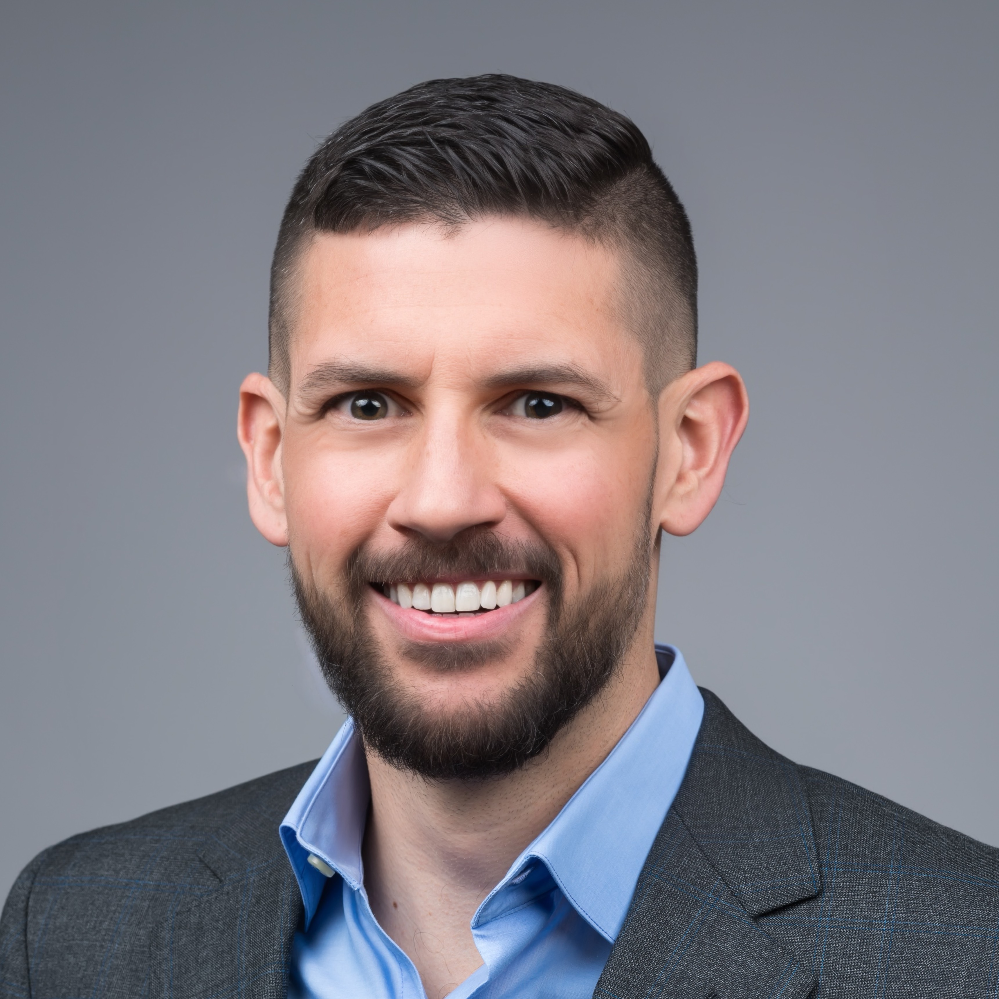

<!-- 
Announcement!
 -->

# What I do

I'm an Assistant Professor in the [Department of
Linguistics](http://www.sas.rochester.edu/lin/index.html) at the
University of Rochester, with a secondary
appointment in the [Department of Computer
Science](https://www.cs.rochester.edu/) and an
affiliation with the [Goergen Institute for Data
Science](http://www.sas.rochester.edu/dsc/). I'm also Director of the
[FACTS.lab](http://factslab.io) at UR, and I co-lead the [MegaAttitude
Project](http://megaattitude.io) and the [Decompositional Semantics
Initiative](http://decomp.io).

# Open positions

I am taking PhD students 
in Linguistics and/or Computer Science this year. I do not respond
to applications for these positions by email. Please apply to the relevant 
department through [the University of Rochester's application system](https://apply.grad.rochester.edu/apply/). 
I encourage you to request a waiver of the application fee, as waivers are 
frequently granted.

# How to find me

| **Email**    | [{{ site.author.mail }}](mailto:{{ site.author.mail }})                             |
| **Github**   | [{{ site.author.github }}](http://github.com/{{ site.author.github }})              |
| **Twitter**  | [{{ site.author.twitter }}](http://twitter.com/{{ site.author.twitter }})           |
| **Office**   | 511A Lattimore Hall                                                                 |

# Where I've been

Before joining the University of Rochester, I was a postdoctoral
fellow at Johns Hopkins University's [Science of
Learning Institute](http://scienceoflearning.jhu.edu/) with
affiliations in the [Department of Cognitive
Science](http://cogsci.jhu.edu/) and the [Center for Language and
Speech Processing](http://www.clsp.jhu.edu/) from 2015 to 2017. I 
received my PhD in [Linguistics](http://ling.umd.edu/) from the University of
Maryland in 2015.
